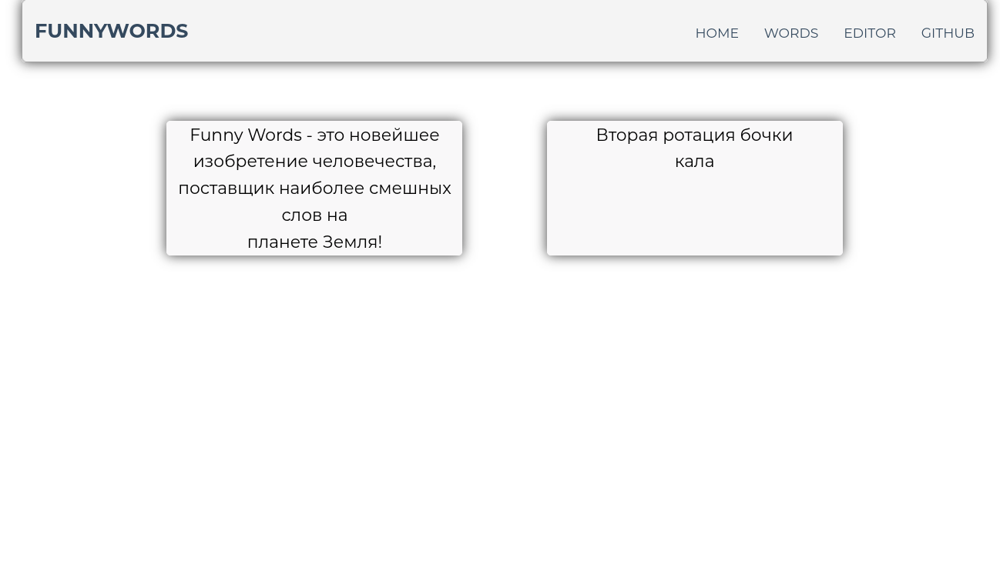
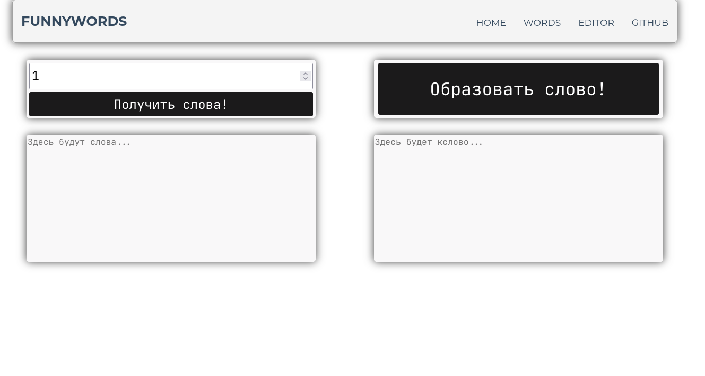

# fwordsweb

fwordsweb stands for Funny Words web

## Screenshots

Home:

Words:

## Contributing

1. Fork it (<https://github.com/Funny-Words/fwordsweb/fork>)
2. Create your feature branch (`git checkout -b my-new-feature`)
3. Commit your changes (`git commit -am 'Add some feature'`)
4. Push to the branch (`git push origin my-new-feature`)
5. Create a new Pull Request

## TODO

* Code words editor

* Code accounts system

## Contributors

* [UberNihilist](https://github.com/uebernihilist) - creator and maintainer
